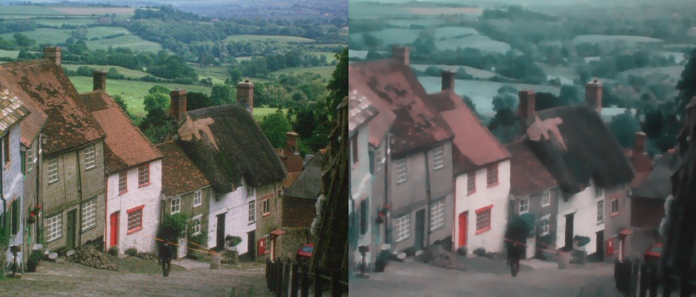

# Variational Image Denoising
#### Quick example usage
Evaluate Chambolle1 (Semi-implicit gradient descent algorithm applied to ROF) on [Gold Hill](https://en.wikipedia.org/wiki/Gold_Hill,_Shaftesbury) image.

``` shell
python main.py
```



#### Installation
##### Dependencies

All of these Python dependencies, can be installed with `pip install -r requirements.txt` inside the root Image folder.

##### Install from source
1. Navigate to your desired installation directory and download the GitHub repository:
``` shell
git clone https://github.com/maranibadr/image
```

1. Navigate to the top-level folder (should be named Image and contain the file `setup.py`) and run `setup.py`:
``` shell
cd Image
python setup.py install
```

That's it!
